# Valley authenticator app
The *Valley authenticator* is an iOS and Android app which can be used for (multi-factor) authentication codes. It supports TOTP, the most common format, and HTOP. TOTP codes use the current time and a secret value to determine the authentication codes. The HTOP codes does only use an counter for its codes. Clicking the code will move the counter to the next code in the generated sequence.

I wrote this application to learn building apps with Xamarin/MAUI. My first version used MAUI, which was in a pre-release state. There were no suitable libraries to scan QR codes, which forced me back to Xamarin. I might rebuild this app with MAUI in the future.

I tried to follow all best practices to ensure the security of this app. However, don’t expect frequent updates. I don’t have the time to actively maintain this codebase. I recommend not using this app for security critical systems.

Feel free to use the code in this repository to develop your own authenticator app. Crediting me in the app would be greatly appreciated. Want to improve the code? Create a pull requests and I might accept and merge it into the repository.

I reused the *valley* part of the name from an identity server solution I built earlier. It has no special symbolic origin or connection to the product category itself.

## ✨ Features
- Works on iOS and Android.
- Support for TOTP and HTOP codes.
- Create, modify or delete entries.
- Add new entries by scanning a QR or entering their details manually.
- View the next code when the timer almost runs out.
- Organize authentication codes in folders.
- Create or rename directories.
- Search for entries or folders.
- Copy authentication codes to the clipboard.
- Copy the label (username) or issuer (website) to the clipboard.
- Import entries from URI lists or JSON text.
- Export an entry as a QR code.
- Export one or more entries to an URI list of JSON text.
- Supports these algorithms: SHA1, SHA256 and SHA512.
- Supports a period of 15s, 30s, 1m, 2m, 5m or 10m.
- Supports between 6 and 12 digits.

## Technologies
The valley authenticator uses **Xamarin**, which makes it possible to run it on both iOS and Android with very little platform specific code. Installing it on an iPhone or running a iOS emulator requires a Mac.

The “logic” behind the app is written in C#. The layout of the pages is defined in `XAML` files.

## Screenshots (iOS)

| | | |
|:---|:---|:---|
| 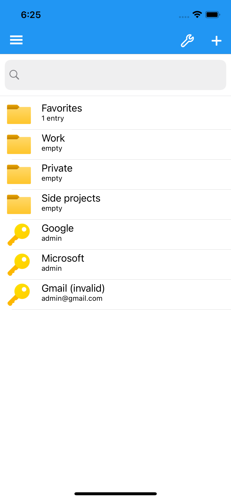 | 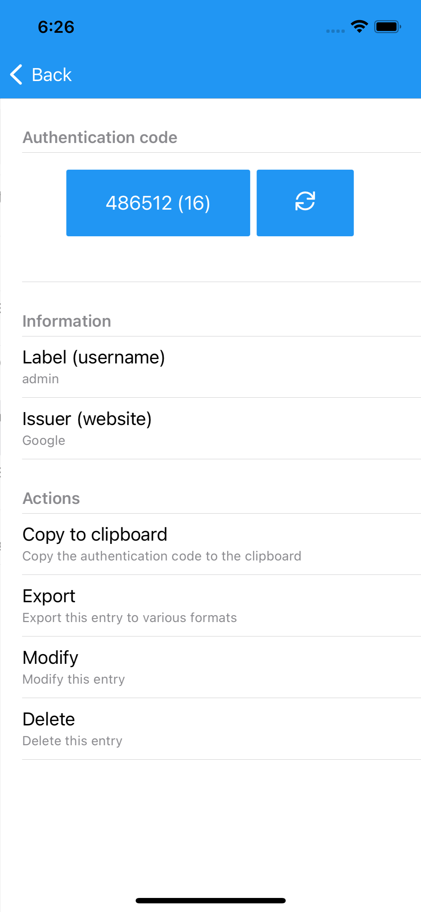 | 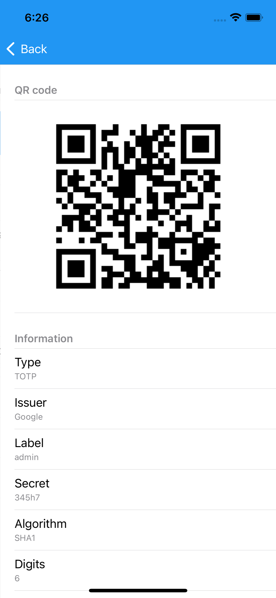 |
| 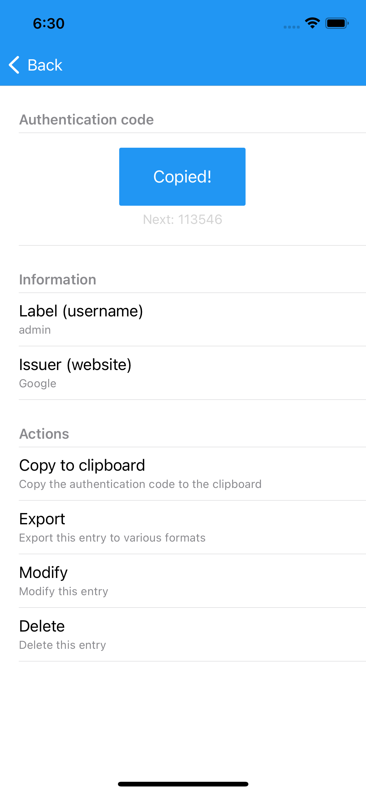 | 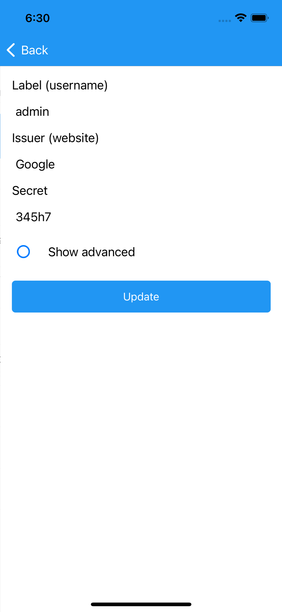 | 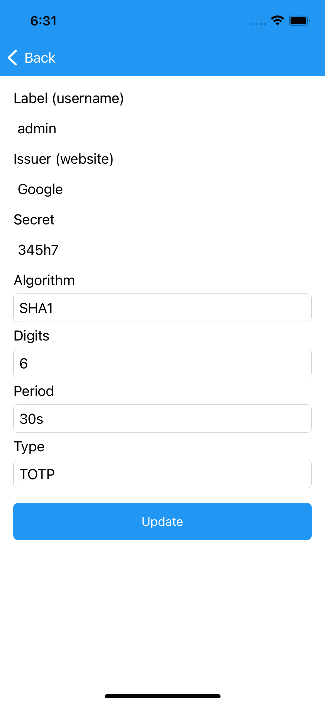 |
| 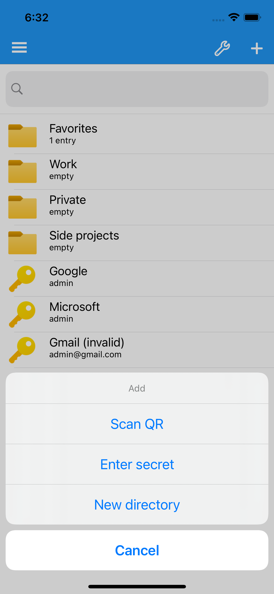 | 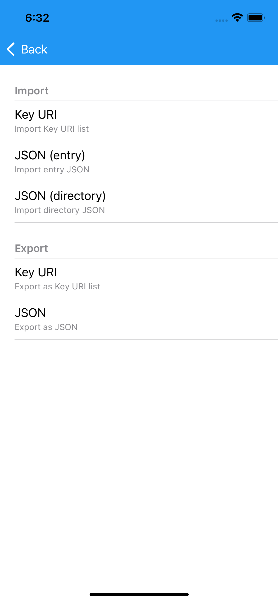 | 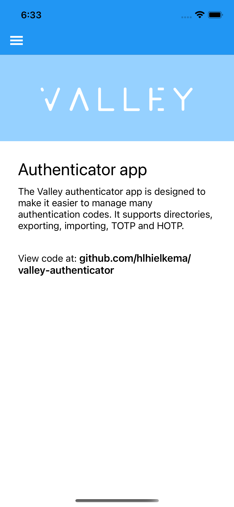 |

---

## Screenshots (Android)

| | | |
|:---|:---|:---|
| 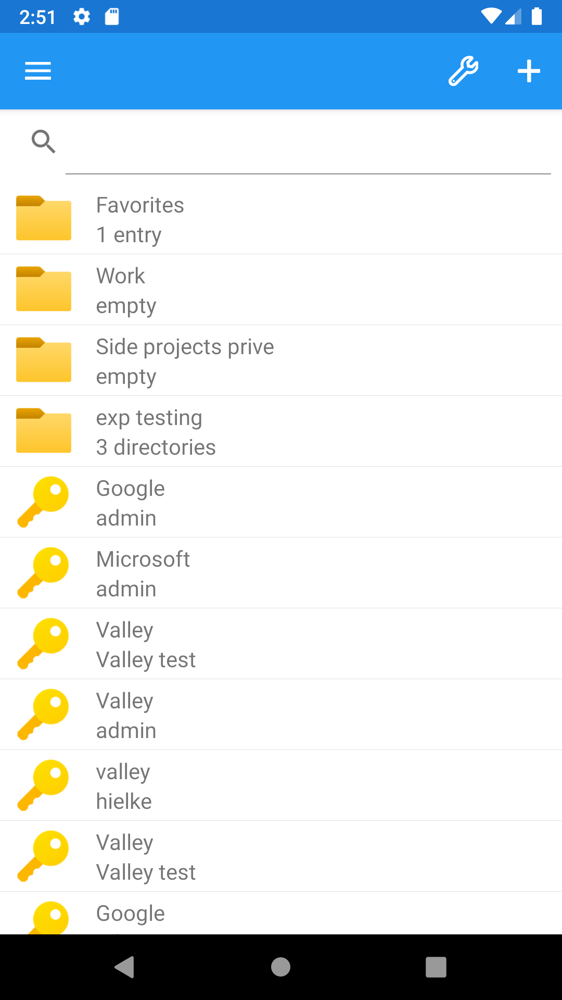 | 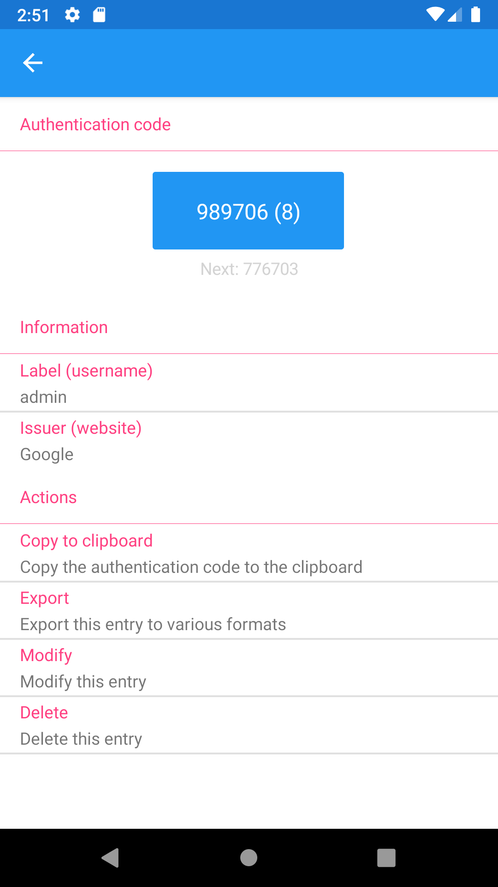 | 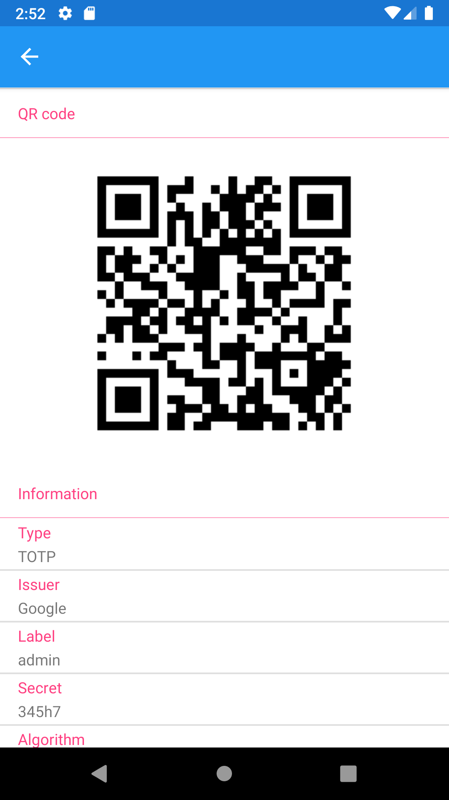 |
| 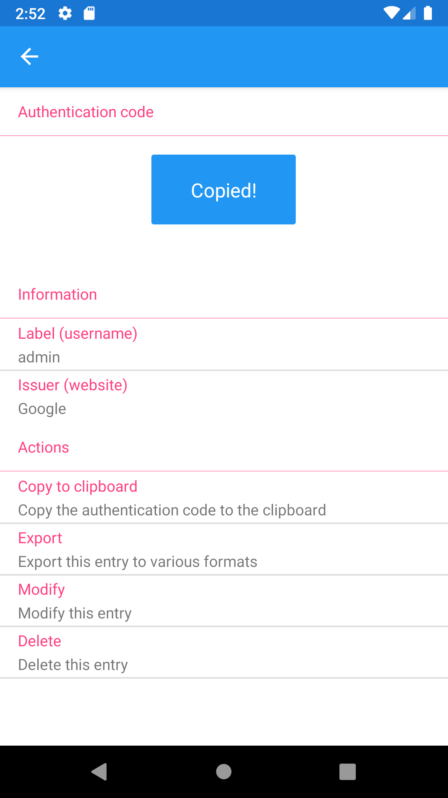 | 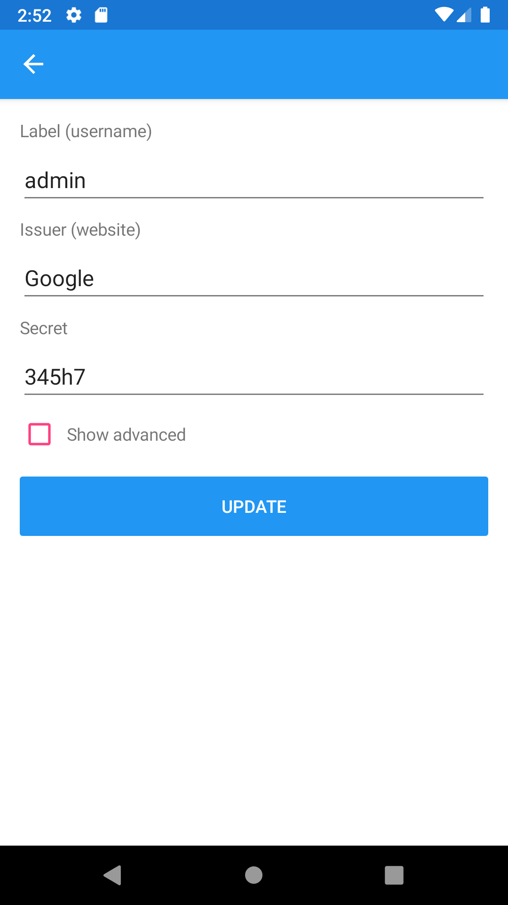 | 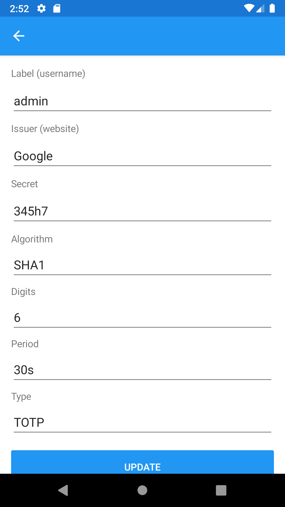 |
| 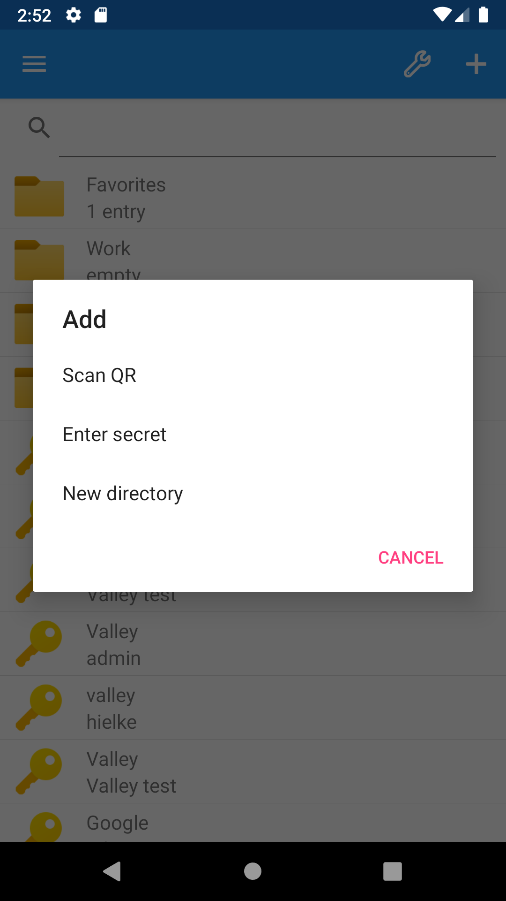 | 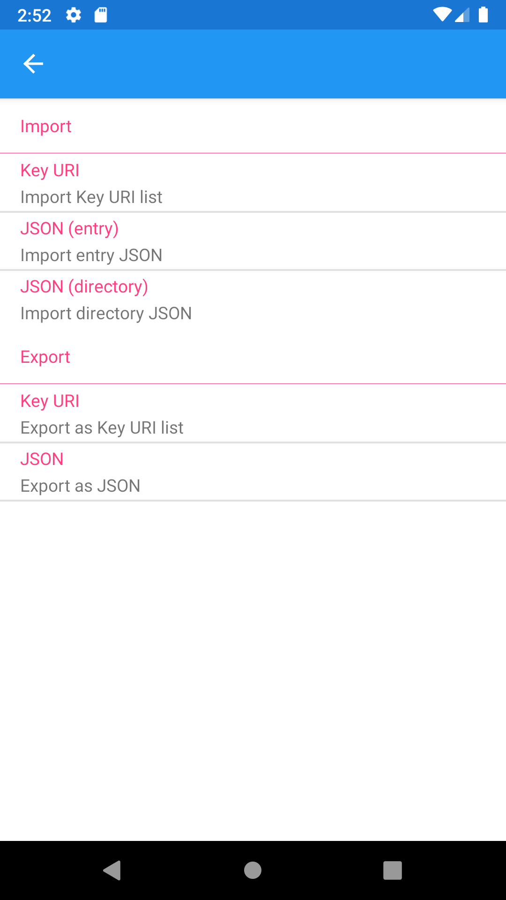 | 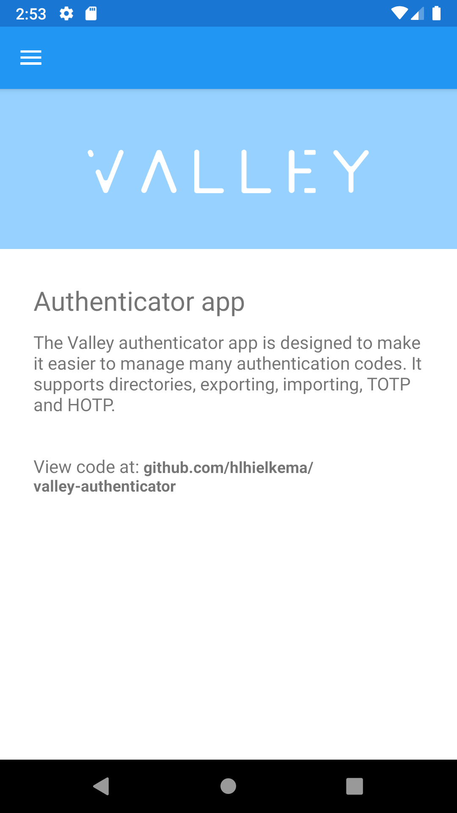 |
